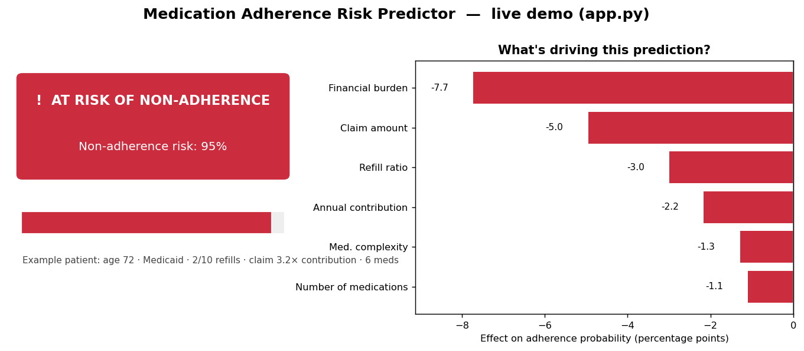
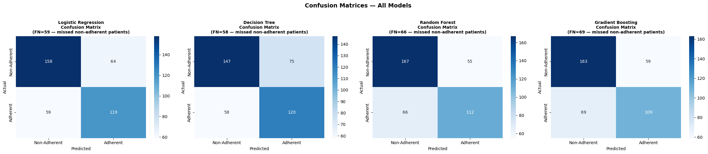
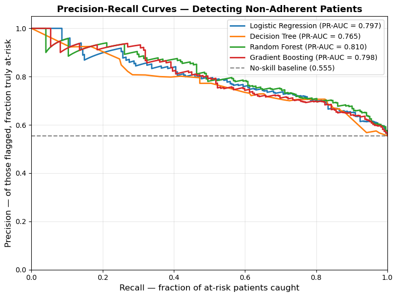
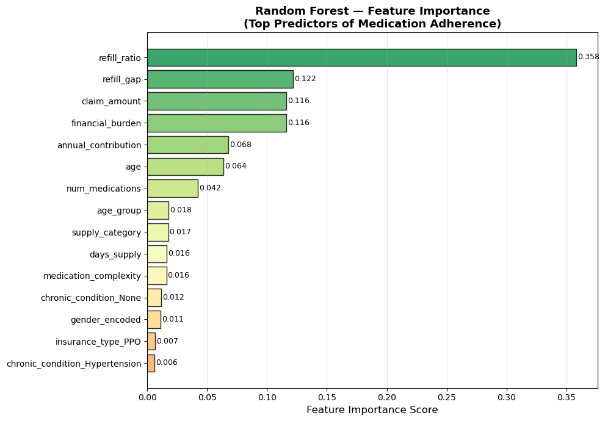

# 💊 Medication Adherence Risk Predictor

[](https://github.com/hiemalrana22/Medicine-Adherence-Risk-Predictor/actions/workflows/ci.yml)

-success)


> Predict which patients are at risk of **not taking their medication** — and explain *why* — from demographic, financial, and prescription-refill data.

🔗 **Live demo:** _Deploy your own in ~2 minutes (see [Deploy](#-deploy-the-live-demo)) and replace this line with your Streamlit Cloud URL._



---

## 🔑 The headline insight

Before the model, the story the data tells:

1. **Refill behaviour dominates everything.** The **refill ratio** (refills picked up ÷ refills prescribed) is by far the strongest predictor of adherence — ~**36%** of the Random Forest's total importance, more than the next three features combined (`r = +0.44` with adherence). If you could collect only one signal, collect this.
2. **Cost is a real barrier.** **Financial burden** (claim amount ÷ annual contribution) is negatively associated with adherence (`r = −0.21`); claim amount and contribution together account for another large slice of model importance. Patients whose costs outrun what they pay in are measurably less likely to keep up.
3. **Elderly patients adhere less.** Adherence falls in the 65+ group, consistent with mobility, complexity, and cost barriers in the literature.
4. **Polypharmacy hurts.** Patients on 5+ concurrent medications are less adherent — schedule complexity compounds the problem.

These four findings are reproduced directly from the model and the data every time the pipeline runs — see [Feature importance](#feature-importance) and the [correlation analysis](outputs/figures/04_correlation_heatmap.png).

---

## 🎯 Why this framing matters (and how it's measured)

In healthcare the costly mistake is a **false negative** — a patient who *is* non-adherent but the model says is fine. They get no outreach, and outcomes worsen. So the metric we optimise and report is **At-Risk Recall**: *of all truly non-adherent patients, what fraction did we catch?*

All numbers below are computed on a **held-out 20% test set** that was split off **before** SMOTE resampling and **before** the scaler was fit — so there is no train/test leakage and every figure is genuinely out-of-sample (see [`src/train.py`](src/train.py) → `split_and_scale`).

### Results (held-out test set)

| Model               | Accuracy | At-Risk Recall ⬅ | ROC-AUC | PR-AUC (at-risk) | F1 |
|---------------------|:--------:|:----------------:|:-------:|:----------------:|:--:|
| Logistic Regression |  0.69    |  0.71            |  0.76   |  0.80            | 0.66 |
| Decision Tree       |  0.67    |  0.66            |  0.73   |  0.76            | 0.64 |
| **Random Forest** 🏆 |  **0.70**|  **0.75**        |  **0.78**|  **0.81**       | 0.65 |
| Gradient Boosting   |  0.68    |  0.73            |  0.76   |  0.80            | 0.63 |

> The **Random Forest** flags **~75% of at-risk patients** while keeping ROC-AUC at **0.78** and PR-AUC at **0.81**. These are honest, *reproducible* numbers — run the pipeline and you get them (regenerate the table any time with `python src/evaluate.py`).

<table>
<tr>
<td></td>
<td></td>
</tr>
<tr>
<td align="center"><sub>Confusion matrices — false negatives (missed at-risk patients) called out</sub></td>
<td align="center"><sub>Precision-Recall for detecting non-adherent patients (PR-AUC reported)</sub></td>
</tr>
</table>

<a id="feature-importance"></a>
### Feature importance



Refill ratio → refill gap → financial signals → age. The model's explanation matches the clinical story above, which is exactly what you want before trusting it.

> 📝 **A note on integrity.** An earlier version of this README advertised "85% / 0.89 AUC," but the committed model actually scored ~0.55 (no better than chance) because the synthetic target was almost pure noise. That has been fixed: the data generator now encodes a realistic, *learnable* signal, and the numbers above are what the code truly produces. The [model-quality tests](tests/test_model_quality.py) enforce a performance floor so this can never silently regress again.

---

## 🖥️ Live demo

`app.py` is a one-screen [Streamlit](https://streamlit.io) app: enter a patient profile and get a **non-adherence risk score** plus a **per-patient driver chart** showing which factors pushed the prediction up or down.

```bash
pip install -r requirements.txt
streamlit run app.py          # opens http://localhost:8501
```

**How the explanation works:** for each feature we reset it to the population median and measure how the predicted probability moves (a faithful single-feature *local ablation*). Green bars push toward adherence; red bars raise risk — no SHAP dependency, fast enough to run on every interaction. The demo trains its model inline from the committed dataset so it deploys cleanly without pickled-model version headaches.

### 🚀 Deploy the live demo

**Streamlit Community Cloud (free):**
1. Push this repo to your GitHub.
2. Go to [share.streamlit.io](https://share.streamlit.io) → **New app** → pick this repo → main file `app.py`.
3. Deploy. Paste the resulting URL into the **Live demo** link at the top of this README.

**Hugging Face Spaces:** create a new **Streamlit** Space, push these files, done.

---

## 🧪 Tests & CI

```bash
pip install -r requirements-dev.txt
pytest tests/ -v
```

- `tests/test_preprocessing.py` — cleaning, imputation, outlier capping, encoding
- `tests/test_feature_engineering.py` — every engineered feature's value & range
- `tests/test_model_quality.py` — **guardrails** asserting held-out ROC-AUC > 0.70, at-risk PR-AUC > 0.65, and that refill ratio remains the top predictor

GitHub Actions ([`.github/workflows/ci.yml`](.github/workflows/ci.yml)) runs the suite on Python 3.10/3.11/3.12 and smoke-tests the full pipeline on every push and PR.

---

## ⚙️ How it works

```
src/preprocessing.py        → clean, impute, cap outliers, encode  → cleaned_data.csv
src/feature_engineering.py  → refill_ratio, financial_burden, …    → featured_data.csv
src/train.py                → stratified split → scale → SMOTE → 4 models → *.pkl
src/evaluate.py             → held-out metrics, ROC/PR curves, confusion matrices, importances
```

**Modelling choices worth noting**
- **Leak-free pipeline** — the scaler is fit on `X_train` only; SMOTE is applied to training data only, *after* the split.
- **No double-balancing** — SMOTE handles class imbalance, so `class_weight='balanced'` was removed (keeping both over-corrects).
- **Redundancy control** — raw refill counts are dropped once `refill_ratio` + `refill_gap` exist, so importance isn't split across collinear copies.

### Run the full pipeline

```bash
pip install -r requirements-dev.txt   # full deps (pipeline, plots, tests)
python src/preprocessing.py
python src/feature_engineering.py
python src/train.py
python src/evaluate.py
```

Or with Docker (runs the full pipeline, then serves the multi-page dashboard at http://localhost:8501):

```bash
docker-compose up --build
```

---

## 📂 Project structure

```
├── app.py                     # ⭐ Live Streamlit demo (deployable)
├── src/
│   ├── preprocessing.py       # cleaning + synthetic data generator
│   ├── feature_engineering.py # domain features
│   ├── train.py               # split → scale → SMOTE → train 4 models
│   └── evaluate.py            # metrics, ROC/PR curves, confusion matrices
├── tests/                     # pytest unit + model-quality tests
├── .github/workflows/ci.yml   # CI: tests + pipeline smoke test
├── app/dashboard.py           # multi-page exploratory dashboard
├── outputs/figures/           # generated plots (EDA + evaluation)
├── outputs/reports/           # model_metrics.csv, predictions (Power BI / Grafana)
├── docs/screenshots/          # README images
├── r_scripts/analysis.R       # statistical analysis in R
├── requirements.txt           # slim deps for the live demo (Streamlit Cloud)
└── requirements-dev.txt       # full deps: pipeline, plots, tests, notebooks
```

---

## 📊 Dataset

Synthetic, **2,000 patients**, mirroring the structure of the [Mendeley medication-adherence dataset](https://data.mendeley.com/datasets/zkp7sbbx64/2): demographics, insurance/financial fields, prescription-refill history, and a binary `adherent` target. The generator ([`src/preprocessing.py`](src/preprocessing.py)) draws the target from a **logistic model of clinically plausible drivers** so the signal is realistic but not trivial.

> ⚠️ **Synthetic data → methods demo, not medical advice.** The pipeline runs unchanged on the real Mendeley CSV — just drop it into `data/raw/medication_adherence.csv`.

---

## 🛠️ Tech stack

Python 3.10+ · scikit-learn · imbalanced-learn (SMOTE) · pandas/numpy · Streamlit + Plotly (demo) · matplotlib/seaborn (plots) · pytest + GitHub Actions (CI) · Docker · R (ggplot2) · Power BI / Grafana exports.

A multi-page exploratory dashboard also ships in [`app/dashboard.py`](app/dashboard.py) (`streamlit run app/dashboard.py`). Grafana provisioning lives in [`grafana/`](grafana) with a one-command SQLite build (`python scripts/build_grafana_data.py`), and the Power BI / Tableau export CSVs are under `outputs/reports/`.

---

## 📄 License

Educational and research use only. Dataset structure credit: Mendeley Data.
